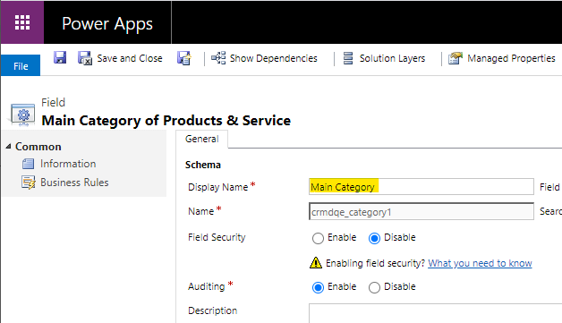
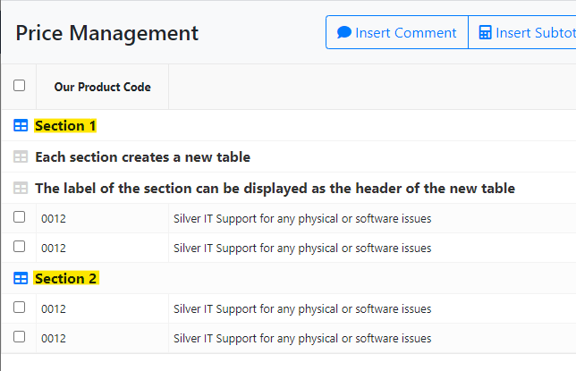

# Version 3.5

**Update 3.5.1**: Moved order management button from the quote header main ribbon to the order subgrid (#157)

**Update 3.5.2**: Improved performance when opening the quote manager for the first time (#227)

---

## Support for multiple languages (#174)

Starting from this release, the Quote Manager support multiple languages. It leverages the Dynamics architecture to read the **Display Name** of the fields within the entities and displays them in the grid.
This allows the system to support multiple languages and to fully customise the Quote Manager grid columns.

A common example is to rename the category fields so that the columns in the Quote Manager display the correct word for your business. Simply navigate to the customisation page for the **Products & Services** entity and modify the display name[^1] of the chosen category field.

_Please Note: **System Customizer** or **System Administrator** security roles are required to perform this type of customisations in Dynamics_

[^1]: _Do not change the **Label** of the field in the form as this will have no effect_

## Quote Sections (#139)

We added the ability to create sections within the quote. This is most useful to divide the quote product lines into separate subsections (i.e. one off items vs recurring payments). Simply insert a comment and check the table icon (it will turn blue when active) and now every line below will be grouped under the same section[^2]. You can add multiple sections by adding more comments and **enabling the feature**, each comment will break the previous section and create a new one.

[^2]: _It is important to note that this functionality merely creates the link between records, it is then responsibility of the user to create the required output in the chosen template solution._

## Revision functionality (#215)

The revision creation has been moved to its own button. The process no longer refreshes the prices from the product database. The latest data from the product database can be retrieved by clicking on the dedicated button. The command can be customised to retrieve any field from the product database, such as description or guidance.

To do so, modify the action **CRMD - Refresh Data from Product** and include any additional step required to implement your business logic. Make sure the action is activated before using this functionality within a quote. **Do Not** modify the action unique name as this will break the functionality.

## Other Changes

- Fixed issue when revising a quote product lines inserted from templates (#208)
- Fixed issue when trying to save a quote away from the main record (#166)
- Fixed prices not refreshing when creating a revision (#212)
- Revamped the Write-In functionality with a new and simplified dialog (#146)
- Product description not displaying correctly in the Price management grid (#184)
- Discount value is now cleared when applying the discount and all lines are deselected (#178)
- Fixed Subtotal text not displaying correctly (#152)
- Added simple template (required fields only) to allow the import of products and services (#168)
- Fixed issue where the revision would remove the text content from comments and subtotals (#155)
- Various performance improvements (#213)
- Added pagination to the PMG, default is 50 lines (#213)
- Fixed subtotal no refreshing when moved (#213)
